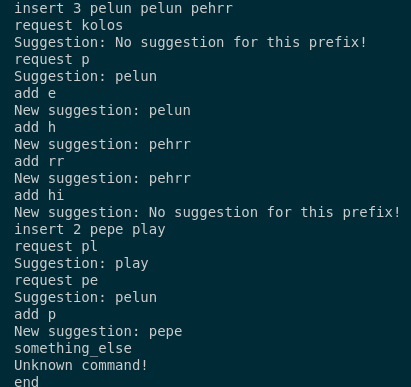

# Моё решение алгоритмической задачи из письменного этапа отбора КИС 2024

## Постановка задачи:

Задача №2 / Алгоритмы

Самым сложным в обучении Джейка Салли необходимому для жизни на Пандоре было
изучение им языка Naʼvi. Нейтири уже почти потеряла веру в него, как вдруг
придумала отличную идею - сделать для Джейка нечто вроде автоматического
подсказатора, который бы по префиксу некоторого слова подсказывал ему
забытый суффикс. Так как сама Нейтири искусно владеет луком, но не языками
программирования - она попросила вас помочь.
Теперь более формально (насколько автору задачи удалось перевести запросы
Нейтири на технический язык). На вход подаются тексты произвольной длины. Затем,
по запросу, программа дополняет слово по некоторому префиксу. Слово, которое
подсказывает программа, должно быть самым популярным среди слов, добавленных
ранее. Также можно использовать функцию “дописывания” и дописать несколько
символов к уже введенному префиксу, получив, возможно, другую подсказку.
Например, типичный сценарий использования программы может выглядеть
следующим образом:
- Добавить текст: “pelun pelun pehrr”
- Запрос: “pe”
-- Подсказка: “pelun”
- Дописывание: “h” (т.е. весь префикс -- “peh”)
-- Подсказка: “pehrr”
- Добавить текст: “pehem pehem pehem”
- Запрос: “pe”
-- Подсказка: “pehem”

Интерфейс программы на ваше усмотрение. Так как Джейк Салли - морпех (а, как
известно, морпехи бывшими не бывают), то к трудностям он привычен - поэтому
достаточно консольного ввода-вывода. Желательно, чтобы при “дописывании”
результат выводился быстрее, чем при запросе с чистой строки, иначе Нейтири
разозлится на Джейка за то, что он долго не может вспомнить нужный суффикс и
снова заставит его бегать от танатора.

## Описание решения

Напишем решение основанное на структуре данных под названием Бор.
Пользователь может взаимодействовать с ним с помощью четырёх команд: 
1) $insert$ - добавление слов; после ввода этой команды необходимо написать количество добавляемых слов и следом написать их без запятых, через пробел.
2) $request$ - запросить ответ для данного префикса; после ввода этой команды программа выдаёт среди добавленных ранее слов самое популярное (если таких несколько, то выдаётся самое первое слово, ставшее самым популярным).
3) $add$ - функция дописывания из условия задачи. Из её особенностей: если перед этим была исполнена команда типа $request$ или $add$, то программа будет продолжать дописывать к уже введённому префиксу, см. пример взаимодействия. Кроме того, если в какой-то момент после исполнения программы $request$ или $add$ не было найдено подходящего слова (было выведено No suggestion for this prefix!) или была выполнена команда $insert$, то программа считает, что уже введённый префикс был обнулён и $add$ будет исполняться соответствующим образом.
4) $end$ - завершение взаимодействия с программой.
5) при некорректном вводе программа проигнорирует ввод и продолжит свою работу.

Пример взаимодействия: 



Запуск программы:

``` g++ AlgSolution.cpp && ./a.out ```

## Описание особенностей решения

Был использован бор, в котором вершиной бора является структура, состоящая из вектора с номерами её детей $next$ (переход в боре происходит по номеру буквы, в качестве моего допущения, будут использоваться только строчные английские буквы), а так же двумя числами - ответ для этой вершины в виде количества самого популярного слова ($maxFrequency$) и соответсвующий ему индекс ($maxFrequentIndex$). Сам бор имеет такие поля как: 
* root_ - номер корневой вершины бора.
* nodeCnt_ - количество инициализированных вершин бора.
* nodePool_ - вектор всех вершин бора.
* wordCount_ - словарь, в котором ведётся подсчёт сколько раз какое слово было введено.
* wordList_ - список всех добавленных ранее слов (каждое слово содержится в единственном экземпляре). 
* wordToIndex_ - вспомогатльный словарь, который присваивает каждому слову свой уникальный индекс в wordList_.

Последнее поле вершины бора и два последних поля самого класса бора были сделаны в угоду экономии памяти, так как благодаря такой реализации каждое слово  в вершине представлено своим индексом и не хранится как отдельная строчка в каждой из вершин.

